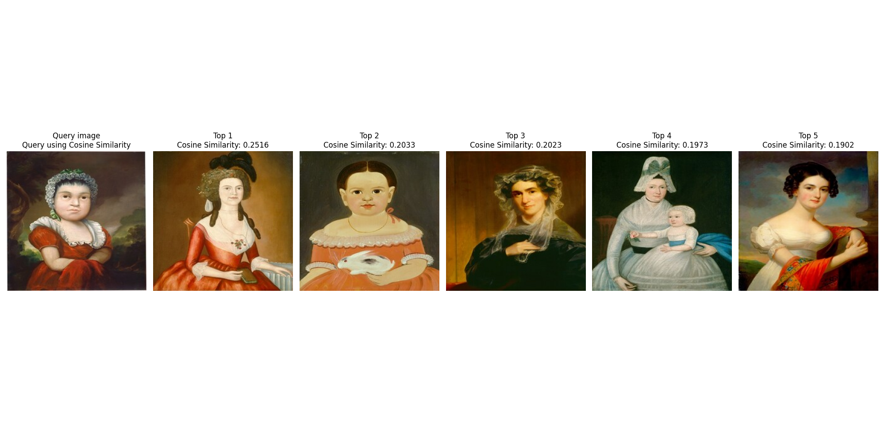

# Folder structure
```
|- Task 1
    | ...
    |- README.md
|- Task 2
    | ... 
    |- README.md
|- README.md
```

# Overview

## Task 1
Problem: Build a model to classify specific Artist, Genre, Style of paintings or the combination of them in ArtGAN dataset. Moreover, the model should also detect outliers in the collections of painting such as realism paintings drawn by a Romanticism-dominant artist.
My approach:
- The problem is divided into 3 task: specific task (one class at a time), general task (3 classes at a time) and detecting outliers. My main metric is F1 score because it is the harmony mean of precision and recall.
- In specific task, I fine-tuned a ResNet50 and achieve 64.45%, 75.99% and 62.25% F1 score in classifying genre, artist and style respectively. I also fine-tuned a vit_base_patch16_224 and achieve 79.30% F1 score in classifying genre, which is 14.85% higher than ResNet50.
- In general task, I develop a Convolutional Recurrent Neural Network that combines ResNet50 with LSTM to tackle the correlation between 3 classes. As a result, I achieve 67.96% F1 score in this task with just 4 epochs.
- The outliers are detected by determining paintings with low confidence score predicted by the models. The results are shown in the below image


## Task 2
Problem: Build a framework to find similarity in paintings in National Gallery Of Art dataset
My approach:
- To find similarity in paintings, I extracted image features and measure the similarity between them.
- My choice of similarity metrices are SSIM (Structural similarity index measure), Cosine Similarity (or Cosine Distance) and RMSE. The metrices are implemented to be chosen by users.
- In the end, the framework exhibits a good performance as shown in the below image


# Citation
```
@article{artgan2018,
  title={Improved ArtGAN for Conditional Synthesis of Natural Image and Artwork},
  author={Tan, Wei Ren and Chan, Chee Seng and Aguirre, Hernan and Tanaka, Kiyoshi},
  journal={IEEE Transactions on Image Processing},
  volume    = {28},
  number    = {1},
  pages     = {394--409},
  year      = {2019},
  url       = {https://doi.org/10.1109/TIP.2018.2866698},
  doi       = {10.1109/TIP.2018.2866698}
}
```
