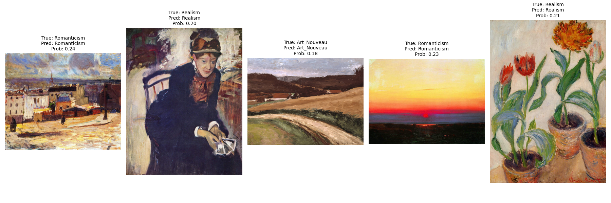

# Dataset
The dataset consists of 9 csv files and folders of images. There are 3 main 'small tasks', including `artist`, `genre` and `style`. Each of the 'small task' has their corresponding _classes.txt, _train.csv and _val.csv files.
- `(small task)_classes.txt`: a txt file with format `label` and `name` of (artist/genre/style)
- `(small task)_train.csv`: a csv file with 2 columns `filename` and `label` for training
- `(small task)_val.csv`: a csv file with 2 columns `filename` and `label` for validation
There are total 81,444 images (57025 images for training and 24421 images for validation). The images are in different sizes, with the shortest side and longest side are 50 and 15530 pixels, respectively.


# Metrics
The specific task is a multiclass classification. And the general task can also be interpreted as multiclass classification, because the model can be designed to output 3 possibilities corresponding to artist, genre and style task. Therefore, simple metrics such as Accuracy, Recall and F1 score are good enough. The main metric here is F1 score because of its harmonic mean of precision and recall, represent the model's performance better. 


# Experiment
## Specific
Initally, Resnet50 was chosen to test due to its lightweight and efficiency. After that, a larger and trending model like ViT is tested to compare with Resnet50 and evaluate the performance of non-traditional CNN. It became apparent that a traditional CNN model performed better than CNN-Transformer in most of the 'small tasks' (+8.11% F1 score in `genre` task and +26.83% F1 score in `style` task). However ViT also showed the potential to achieve high F1 score on `artist` task (+14.85% F1 score in `artist` task).

Table. Macro average Precision, Recall and F1 score (%) of Resnet50 and ViT on 3 different 'mini tasks'.
| **Architecture (Task)** | **Precision** | **Recall** | **F1** | 
| ----------------   | :-------: | :----:  | :--: |
| Resnet50 (Artist)  | 65.62     | 65.41   | 64.45 | 
| ViT (Artist)       | **80.74** | **79.46**| **79.30** | 
| ----------------   | --------- | ------  | ---- |
| Resnet50 (Genre)   | **76.34** | **75.94** | **75.99** | 
| ViT (Genre)        | 71.19     | 67.89 | 67.88 | 
| ----------------   | --------- | ------  | ---- |
| Resnet50 (Style)   | **64.84** | **62.23** | **62.25** | 
| ViT (Style)        | 39.44     | 36.29   | 35.42 | 


## General
The model used in this case is Resnet50+LSTM. This simple combination achieves 67.96% Overall F1 score on validation dataset.
Table. Overall Precision, Recall and F1 score (%) of Resnet50+LSTM on general task.
| **Architecture** | **Precision**  | **Recall** | **F1** | 
| ---------------- | :-------:      | :----:     | :--:   | 
| Resnet50+LSTM    | 67.96          | 67.96      | 67.96  | 

## Outlier
Outlier is the images with confidence below some threshold, which default to be 0.25.  


# Configuration
## Specific
Both model use the same hyperparameters for the same tasks. The data augmentation I use is normalizing pixel value (by divide 255.0) with CutMix and MixUp. These augmentations were intended to help the model generalize better (due to limited Kaggle GPU usage per week, I do not have abundant computing resources to do a ablation study on this).

### Resnet50
Table. configuration for Resnet50 on specific tasks
| Task | n_epochs | lr | optimizer | scheduler | 
| ----- | -------- | -- | --------- | --------- |
| Artist | 3 | 1e-4 | AdamW (weight_decay=1e-5) | ReduceLROnPlateau |
| Genre | 3 | 1e-4 | AdamW (weight_decay=1e-5) | ReduceLROnPlateau |
| Style | 4 | 1e-3 | AdamW (weight_decay=0.00025) | StepLR (step_size=1, gamma=0.66) |

### ViT
Table. configuration for ViT on specific tasks
| Task | n_epochs | lr | optimizer | scheduler |
| :-----: | :--------: | :--: | --------- | --------- |
| Artist | 3 | 1e-4 | AdamW (weight_decay=1e-5) | ReduceLROnPlateau |
| Genre | 3 | 1e-4 | AdamW (weight_decay=1e-5) | ReduceLROnPlateau |
| Style | 4 | 1e-3 | AdamW (weight_decay=0.00025) | StepLR (step_size=1, gamma=0.66) |


## General
Table. configuration for Resnet50+LSTM on general tasks
| Task | n_epochs | lr | optimizer | scheduler | 
| :-----: | :--------: | :--: | --------- | --------- |
| General | 4 | 5e-4 | AdamW (weight_decay=000025) | StepLR (step_size=1, gamma=0.66) |


# Dicussion
Due to limited time, I can only concluded that the Resnet50 can performs well on the task, with the evaluation metrics are precision, recall and f1 score. For further improvements on the task, I recommend finetuning the hyperparameters of the models such as finetune the learning rate, and experimenting other models such as EfficientNet and other variants of Resnet such as Wide Resnet.


# How to reproduce the results
## Kaggle
1. Clone this repository.
2. Add the dataset to kaggle input.
3. Import the `wikiart_specific.ipynb` or `wikiart_general.ipynb` notebook in the `File` menu. In the `Settings` -> `Accelerator`, choose GPU P100 and run the notebook from top to bottom.
4. (Optional) If you want to use ViT for Specific task, you can uncomment the last GradCam part to see the attention map.

## Personal computer (GPU required)
1. Clone this repository.
2. Install required python package:
```
pip install -r requirements.txt
```
3. Run the main script
```
python main.py --data_path "./data" --pretrained "./weights/wikiart_resnet50_style.pt"
```

--data_path "./data": Path storing the wikiart folder

--pretrained "./weights/wikiart_resnet50_style.pt": Path storing model weights for a pretrained resnet50 on wikiart dataset

## Model weights
| Model | Task | Link |
| :-- | :-- | :--: |
| Resnet50 | Artist | [Link](https://www.kaggle.com/models/thnhtt/wikiart-model-weights) |
| Resnet50 | Genre | [Link](https://www.kaggle.com/models/thnhtt/wikiart-model-weights) |
| Resnet50 | Style | [Link](https://www.kaggle.com/models/thnhtt/wikiart-model-weights)  |
| ViT | Artist | [Link](https://www.kaggle.com/models/thnhtt/wikiart-model-weights)  |
| ViT | Genre | [Link](https://www.kaggle.com/models/thnhtt/wikiart-model-weights)  |
| ViT | Style | [Link](https://www.kaggle.com/models/thnhtt/wikiart-model-weights)  |
| Resnet50+LSTM | General | [Link](https://www.kaggle.com/models/thnhtt/wikiart-model-weights) |


# Folder structure
```
|- configs: contains data, model configs
|- experiment: contains images of the model results
|- models: contains main model
|- utils: contains visualize functions and dataset
|- evaluate.py: contains evaluation scripts
|- main.py: script to reproduce the result
|- README.md: a report of models and findings for the Task 1
|- requirements.txt: contains neccessary python library to execute the script 
|- wikiart_general.ipynb: notebook version of general task
|- wikiart_specific.ipynb: notebook version of specific task
```


# Citation
```
@article{artgan2018,
  title={Improved ArtGAN for Conditional Synthesis of Natural Image and Artwork},
  author={Tan, Wei Ren and Chan, Chee Seng and Aguirre, Hernan and Tanaka, Kiyoshi},
  journal={IEEE Transactions on Image Processing},
  volume    = {28},
  number    = {1},
  pages     = {394--409},
  year      = {2019},
  url       = {https://doi.org/10.1109/TIP.2018.2866698},
  doi       = {10.1109/TIP.2018.2866698}
}

@misc{he2015deepresiduallearningimage,
      title={Deep Residual Learning for Image Recognition}, 
      author={Kaiming He and Xiangyu Zhang and Shaoqing Ren and Jian Sun},
      year={2015},
      eprint={1512.03385},
      archivePrefix={arXiv},
      primaryClass={cs.CV},
      url={https://arxiv.org/abs/1512.03385}, 
}

@misc{dosovitskiy2021imageworth16x16words,
      title={An Image is Worth 16x16 Words: Transformers for Image Recognition at Scale}, 
      author={Alexey Dosovitskiy and Lucas Beyer and Alexander Kolesnikov and Dirk Weissenborn and Xiaohua Zhai and Thomas Unterthiner and Mostafa Dehghani and Matthias Minderer and Georg Heigold and Sylvain Gelly and Jakob Uszkoreit and Neil Houlsby},
      year={2021},
      eprint={2010.11929},
      archivePrefix={arXiv},
      primaryClass={cs.CV},
      url={https://arxiv.org/abs/2010.11929}, 
}
```
