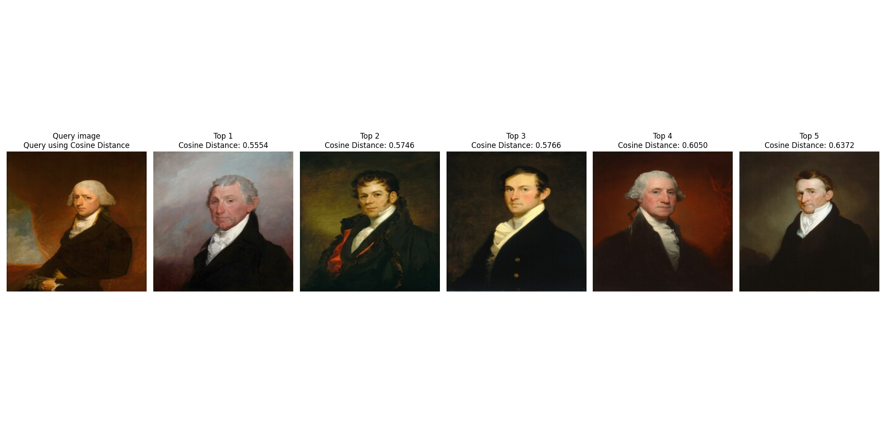

# Dataset
[[download_data.py](utils/download_data.py)] The dataset contains diverse images with 122477 images in published_images.csv (last updated: 29/03/2025). And there are 3926 images (last updated: 28/03/2025) with classification equals to "painting" in objects.csv. 

# Metrics
[[metrics.py](utils/metrics.py)]
Three main chosen metrics are **Cosine Distance**, **Structural similarity index measure (SSIM)** and **Root mean squared error (RMSE)**:
- (Optional) Cosine Similarity: [Cosine Similarity](https://en.wikipedia.org/wiki/Cosine_similarity)
- Cosine Distance: 1 - [Cosine Similarity](https://en.wikipedia.org/wiki/Cosine_similarity)
- SSIM: [SSIM](https://en.wikipedia.org/wiki/Structural_similarity_index_measure) 
- RMSE: Square root of [MSE](https://en.wikipedia.org/wiki/Mean_squared_error) 


# Dicussion


The idea for finding similarity is to use a feature extractor (such as a pretrained CNN model) to extract important feature embeddings and then calculate the 'similarity metric' (such as cosine similarity) to determine how similar 2 images are. In this case, I use Resnet50 to extract and use metrics such as Cosine Similarity, SSIM and RMSE to compare the similarity between 2 images. The lower the cosine distance, the RMSE and the greater the cosine similarity, the SSIM are, the more similar 2 images are.

Overall Cosine Similarity (and Cosine Distance) results in better image similarity. This may be due to the properties of the metric, which focuses on the orientation or direction of the two computed vector. Therefore, Cosine Distance can compare the patterns of the two images better. In the other hand, querying using SSIM score sometimes returns not visually similar such as [SSIM results seed 36](experiment/images/query_results_ssim_seed36.png)

# How to reproduce the results
## Personal computer 
1. Clone this repository.
2. Install required python package:
```
pip install -r requirements.txt
```
3. Run the main script (will use GPU if possible)
```
python main.py --data_path .../opendata --output_path ./output --size 100 --save_figure True --figure_name './experiment/images/resnet50_query_results' --seed 35 --metric cosine_similarity
```

--data_path D:/.../opendata: Path storing the NGA repo folder

--output_path ./output: Path where the downloaded images will be stored

--size 100: Number of images to download

--figure_name ./experiment/images/resnet50_query_results.png': Path to store the visualized image

--seed 35: Seed to generate random index for random query image

--metric cosine: Metrics used to query image

# Folder structure
```
|- configs
    |- config.py
|- experiment: contains images of the model results
|- models: contains model and related functions
|- utils
    |- dataset.py:
    |- download_data.py:
    |- metrics.py: contains metrics rmse, ssim
    |- visualize.py: contains class to query and visualize similar images
|- main.py: script to reproduce the result
|- README.md: a report of models and findings for the Task 2
|- requirements.txt: contains neccessary python library to execute the script 
```

# Citation
```
https://github.com/NationalGalleryOfArt/opendata
```
